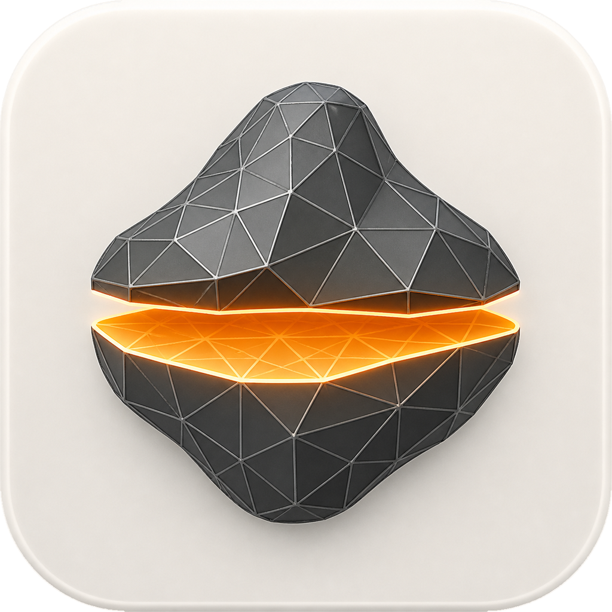
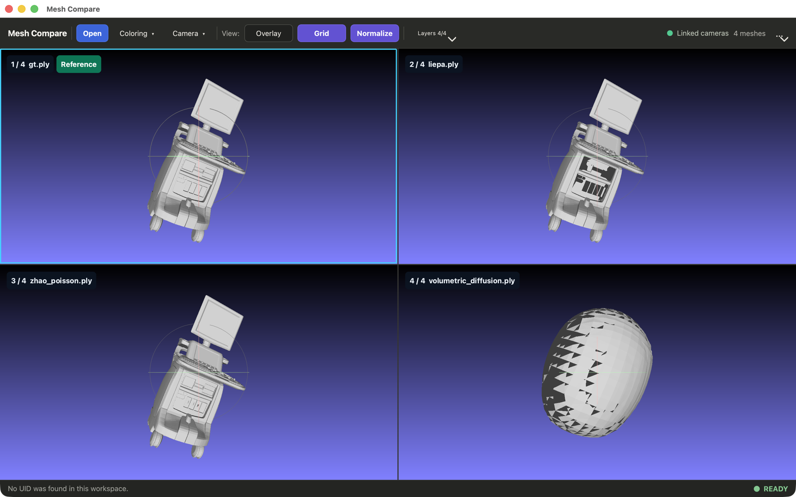
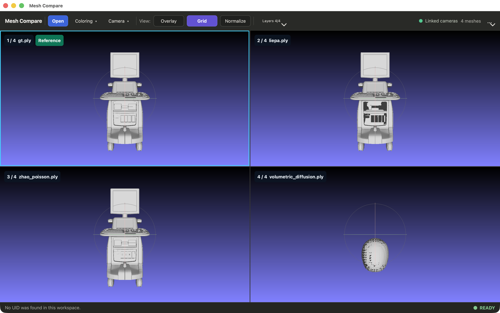
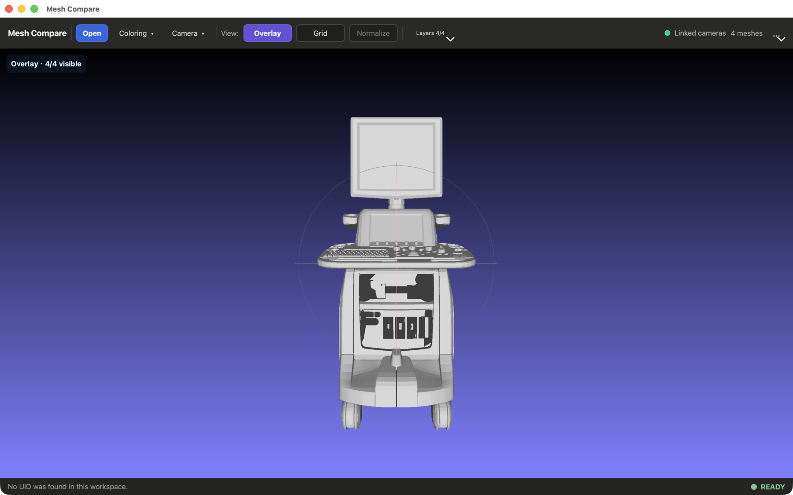

<div align="center">
  
  <h1>Mesh Compare</h1>
  <p>A focused macOS workspace for visual and quantitative mesh comparison.</p>
</div>



## Highlights

- Open **1–8 meshes** or a multi-layer MeshLab project.
- Compare meshes in a **linked camera grid** or a single **overlay view**.
- **Normalize** every Grid mesh independently for easier shape comparison.
- Run **Distance to Reference** and **Double Layer** analyses with color overlays.
- Choose the Reference mesh, assign uniform colors, and control layer visibility.
- Force **double-sided rendering** for open or inconsistently wound surfaces.
- Save reusable camera poses with tags and screenshots.
- Render comparison grids from the command line.

## Views

| Linked Grid | Overlay |
|:--:|:--:|
|  |  |
| Inspect each mesh in its own synchronized viewport. | Inspect all visible layers in one viewport. |

## Quick Start

Open files from Finder, drag them into the window, or use **Open** in the
toolbar. Supported mesh formats are `.obj`, `.ply`, `.stl`, `.off`, and
embedded `.glb`.

```bash
# Open one or more meshes
open build/dist/meshcompare.app --args reference_gt.obj candidate.obj

# Open one MeshLab project
open build/dist/meshcompare.app --args comparison.mlp
```

The first mesh whose name contains `gt` becomes the initial Reference. If no
mesh matches, Mesh Compare uses the first imported mesh.

## Build

Requirements: CMake 3.18+, Qt 5.15, a C++ toolchain, and the platform OpenGL
SDK. MeshLab/VCGLib sources are vendored in `third_party/`.

```bash
cmake -S . -B build \
  -DCMAKE_BUILD_TYPE=Release \
  -DCMAKE_PREFIX_PATH=/path/to/Qt/5.15
cmake --build build --target meshcompare --parallel
```

The macOS bundle is written to:

```text
build/dist/meshcompare.app
```

Run the test suite with:

```bash
cmake -S . -B build -DBUILD_TESTING=ON
cmake --build build --parallel
ctest --test-dir build --output-on-failure
```

## Batch Rendering

Render an `.mlp` project to a PNG without opening the application window:

```bash
build/dist/meshcompare.app/Contents/MacOS/meshcompare \
  --render-grid comparison.mlp \
  --output-dir ./renders \
  --size 2048x1152 \
  --coloring distance
```

Use `meshcompare --help` for camera, saved-pose, coloring, and output options.

## Architecture

Mesh Compare owns its workspace, UI, analysis, camera library, and diagnostics.
The vendored MeshLab viewport engine is isolated behind a renderer adapter; the
legacy MeshLab window, docks, filters, and editing tools are not packaged.

See [docs/architecture.md](docs/architecture.md) for implementation details.

## License

See [LICENSE.txt](LICENSE.txt).
